## webpack打包原理

### 为什么需要webpack

> 要实现模块的按需加载，就需要一个对整个代码库中的模块进行静态分析、编译打包的过程。Webpack就是在这样的需求中应运而生。Webpack是一个模块打包器，它将根据模块的依赖关系进行静态分析，然后将这些模块按照指定的规则生成对应的静态资源。

### webpack能做什么

> (1)代码拆分 Webpack有两种组织模块依赖的方式，同步和异步。异步依赖作为分割点，形成一个新的块。在优化了依赖树后，每一个异步区块都作为一个文件被打包。(2)Loader Webpack本身只能处理原生的JavaScript模块，但是loader转换器可以将各种类型的资源转换成JavaScript模块。这样，任何资源都可以成为Webpack能够处理的模块。(3)智能解析 几乎可以处理任何第三方库，无论它们的模块形式是CommonJS、AMD还是普通的JS文件。(4)插件系统。(5)快速运行 Webpack使用异步I/O和多级缓存提高运行效率。

### 分析官方文档中minipack项目源码，理解打包原理

* 原始代码


```js
//入口文件 entry.js
import meaasge from './message.js'

console.log(message)

//meaasge.js
import {name} from './name.js'

export default `hello ${name}!`

//name.js
export const name = 'world'
```
* 读取文件内容，分析依赖

* > 步骤一 解析源码，生成抽象语法树，递归生成依赖关系对象graph
```js
//首先创建一个接受文件路径的函数，然后读取其内容，并提取依赖关系
function createAsset (filename) {
  // 以字符串形式读取文件内容
  const content = fs.readFileSync(filename,'utf-8')
  //尝试找出这个文件所依赖的文件，可通过查看导入字符串的内容，但这非常笨重，可以使用JavaScript解析器。
  //Javasrcipt解析器是可以读取和理解JavaScript代码的工具，可生成一个更抽象的模型，成为AST(抽象语法树)
  const ast = babylon.parse(content, {
    sourceType: 'module'
  })
  // 此数组将保存此模块所依赖的模块的相对路径
  const dependencies = []
  // 遍历AST树，了解这个模块所依赖的模块，为此检查AST中的每个导入声明
  traverse(ast, {
    //EcmaScript模块非常简单，因为它们是静态的。这以为着无法import变量或者有条件地导入另一个模块。当看到import语句时，都可以将其作为依赖项进行计数。
    ImportDeclaration: ({node}) => {
      // push值到依赖项数组中
      dependencies.push(node.source.value)
    }
  })
  //通过一个简单的方法为这个模块分配一个唯一的标识符
  const id = ID ++
  //我们使用EcmaScript模块和所有浏览器可能不支持的其他JavaScript功能。 为确保我们的捆绑包在所有浏览器中运行，我们将使用Babel进行转换（请参阅https://babeljs.io）。
  //`presets`选项是一组告诉Babel如何转换的规则
  //我们的代码。 我们使用`babel-preset-env`将我们的代码转换为大多数浏览器可以运行的代码。
  const {code} = transformFormAst(ast,null,{
    presets: ['env']
  })
  //返回有关此模块的所有信息
  return {
    id,filename,dependencies,code
  }
}
//现在我们可以提取单个模块的依赖关系了，首先提取条目文件的依赖项，然后将提取每一个的依赖关系依赖项。继续这样做直到弄清楚每个模块在应用程序中以及它们如何依赖。对项目的这种理解称为依赖图
function  createGraph（entry）{
  //首先解析条目文件。
  const  mainAsset  =  createAsset（entry）;

  //我们将使用队列来解析每个资产的依赖关系。因此，我们定义了一个只包含入口资产的数组
  const  queue  = [mainAsset];

  //我们使用`for ... of`循环迭代队列。最初的队列
  //只有一个资产，但是当我们迭代它时，我们将推送额外的新资产
  //进入队列 当队列为空时，此循环将终止。
  for（const asset of queue）{
    //我们的每个资产都有一个模块的相对路径列表
    //取决于。我们将迭代它们，用我们的解析它们
    // `createAsset（）`函数，并跟踪该模块所具有的依赖关系
    asset.mapping  = {};

    //这是该模块所在的目录。
    const  dirname  =  path.dirname(asset.filename);

    //我们遍历其依赖项的相对路径列表。
    asset.dependencies.forEach（relativePath  => {
      //我们的`createAsset（）`函数需要一个绝对文件名。该
      // dependencies数组是相对路径的数组。这些路径是
      //相对于导入它们的文件。我们可以改变相对路径
      //通过将其与目录的路径连接成绝对的
      //父资产
      const  absolutePath  =  path.join（dirname，relativePath）;

      //解析资产，读取其内容并提取其依赖项。
      const  child  =  createAsset（absolutePath）;

      //我们必须知道`asset`取决于`child`。我们
      //通过向`mapping`添加新属性来表达这种关系
      //具有子ID的对象。
      asset.mapping [relativePath] =  child.id ;

      //最后，我们将子资产推送到队列中，以便它的依赖关系
      //也将被迭代并解析。
      queue.push(child)
    }）;
  }

  //此时队列只是一个包含目标中每个模块的数组
  //应用程序：这就是我们表示图形的方式。
  return queue;
}

// createGraph函数生成的依赖关系对象
[ 
  { id: 0,
    filename: './example/entry.js',
    dependencies: [ './message.js' ],
    code: '"use strict";\n\nvar _message = require("./message.js");\n\nvar _message2 = _interopRequireDefault(_message);\n\nfunction _interopRequireDefault(obj) { return obj && obj.__esModule ? obj : { default: obj }; }\n\nconsole.log(_message2.default);',
    mapping: { './message.js': 1 } },

  { id: 1,
    filename: 'example/message.js',
    dependencies: [ './name.js' ],
    code: '"use strict";\n\nObject.defineProperty(exports, "__esModule", {\n  value: true\n});\n\nvar _name = require("./name.js");\n\nexports.default = "hello " + _name.name + "!";',
    mapping: { './name.js': 2 } },

  { id: 2,
    filename: 'example/name.js',
    dependencies: [],
    code: '"use strict";\n\nObject.defineProperty(exports, "__esModule", {\n  value: true\n});\nvar name = exports.name = \'world\';',
    mapping: {} } 
	
]
```

* > 步骤二 将代码打包成可以在浏览器中运行的包

```js
//接下来，我们定义一个函数，它将使用我们的图并返回一个包
//我们可以在浏览器中运行
//
//我们的包只有一个自调用功能：
//
//（function（）{}）（）
//
//该函数只接收一个参数：一个包含信息的对象
//关于我们图表中的每个模块。
function bundle（graph）{
  let modules =  '' ;

  //在我们到达该函数的主体之前，我们将构造该对象
  //我们将作为参数传递给它。请注意我们这个字符串
  //构建由两个花括号（{}）包裹，因此对于每个模块，我们添加
  //这种格式的字符串：`key：value，`。
  graph.forEach（mod  => {
    //图中的每个模块都在此对象中有一个条目。我们用的是
    //模块的id作为键和值的数组（我们有2个值
    //每个模块）
    //
    //第一个值是用函数包装的每个模块的代码。这个
    //因为模块应该是作用域的：在一个模块中定义一个变量
    //不应该影响他人或全球范围。
    //
    //在我们编译之后，我们的模块使用CommonJS模块系统：
    //他们期望`require`，`module`和`exports`对象
    //可用 这些通常不在浏览器中提供，所以我们会
    //实现它们并将它们注入我们的函数包装器中。
    //
    //对于第二个值，我们将模块与其之间的映射进行字符串化
    //依赖项。这是一个如下所示的对象：
    // {'./relative/path'：1}。
    //
    //这是因为我们模块的转换代码有调用
    // `require（）`和相对路径。调用此函数时，我们应该
    //能够知道图中哪个模块对应于那个亲戚
    //此模块的路径
    modules + =  ` $ { mod。id }：[
      function（require，module，exports）{
        $ { mod。代码}
      }，
      $ { JSON。字符串化（MOD。映射）}，
    ]，` ;
  }）;

  //最后，我们实现了自调用函数的主体。
  //
  //我们首先创建一个`require（）`函数：它接受一个模块id和
  //在我们之前构建的`modules`对象中查找它。我们
  //对两值数组进行解构以获取我们的函数包装器和
  //映射对象
  //
  //我们模块的代码用相对文件路径调用`require（）`
  //而不是模块ID。我们的require函数需要模块ID。还有，两个
  //模块可能`require（）`相同的相对路径，但意味着两个不同
  //模块
  //
  //要处理这个问题，当需要一个模块时，我们会创建一个新的专用模块
  // `require`函数供它使用。它将特定于该模块和
  //将知道通过使用模块将其相对路径转换为id
  //映射对象 映射对象正是它之间的映射
  //该特定模块的相对路径和模块ID。
  //
  //最后，对于CommonJs，当需要一个模块时，它可以通过公开值
  //改变它的`exports`对象。`exports`对象，在它之后
  //由模块的代码更改，从`require（）`函数返回。
  const  result  =  `
    （function（modules）{
      function require（id）{
        const [fn，mapping] = modules [id];
        function localRequire（name）{
          return require（mapping [name]）;
        }
        const module = {exports：{}};
        fn（localRequire，module，module.exports）;
        return module.exports;
      }
      require（0）;
    }）（{ $ { modules } }）
  ` ;

  //我们只是返回结果，欢呼！:)
  return result;
}

// 首先将依赖关系图解析成如下字符串

//关键代码
modules + =  ` $ { mod。id }：[
      function（require，module，exports）{
        $ { mod。代码}
      }，
      $ { JSON。字符串化（MOD。映射）}，
    ]，`

 // 解析结果
  0: [
    function (require, module, exports) {
      // -------------- mod.code --------------
      "use strict";
      var _message = require("./message.js");
      var _message2 = _interopRequireDefault(_message);
      function _interopRequireDefault(obj) { 
        return obj && obj.__esModule ? obj : { default: obj }; 
      }

      console.log(_message2.default);
      // --------------------------------------
    },
    {"./message.js":1},
  ],
  1: [
    function (require, module, exports) {
      // -------------- mod.code --------------
      "use strict";
      Object.defineProperty(exports, "__esModule", { //Object.defineProperty 会直接在一个对象上定义一个新属性，或者修改一个对象的现有属性，并返回这个对象
        value: true
      });
      var _name = require("./name.js");
      exports.default = "hello " + _name.name + "!";
      // --------------------------------------
    },
    {"./name.js":2},
  ],
  
  2: [
    function (require, module, exports) {
      // -------------- mod.code --------------
      "use strict";
      Object.defineProperty(exports, "__esModule", {
        value: true
      });
      var name = exports.name = 'world';
      // --------------------------------------
    },
    {},
  ],
// 与源码比较，babel在转换原始code的时候，引入了require函数来解决模块引用问题。但其实浏览器仍然是不认识的。因此还需要额外定义一个require函数

function require(id) {
	const [fn, mapping] = modules[id];

	function localRequire(name) {
		return require(mapping[name]);
	}

	const module = { exports: {} };

	fn(localRequire, module, module.exports);

	return module.exports;
}
// 得到字符串后，再最后拼接起来，还需要定义一个自执行函数文本，并将上述字符串传入其中
(function (modules) {
	function require(id) {
		const [fn, mapping] = modules[id]; // 解构赋值

		function localRequire(name) {
			return require(mapping[name]);
		}

		const module = { exports: {} };

		fn(localRequire, module, module.exports);

		return module.exports;
	}

	require(0);
})({
	0: [
		function (require, module, exports) {
			"use strict";
			var _message = require("./message.js");
			var _message2 = _interopRequireDefault(_message);
			function _interopRequireDefault(obj) {
				return obj && obj.__esModule ? obj : { default: obj };
			}

			console.log(_message2.default);
		},
		{ "./message.js": 1 },
	],
	1: [
		function (require, module, exports) {
			"use strict";
			Object.defineProperty(exports, "__esModule", {
				value: true
			});
			var _name = require("./name.js");
			exports.default = "hello " + _name.name + "!";
		},
		{ "./name.js": 2 },
	],

	2: [
		function (require, module, exports) {
			"use strict";
			Object.defineProperty(exports, "__esModule", {
				value: true
			});
			var name = exports.name = 'world';
		},
		{},
	],
})
// 递归调用require函数最终生成执行结果
```

## 总结

