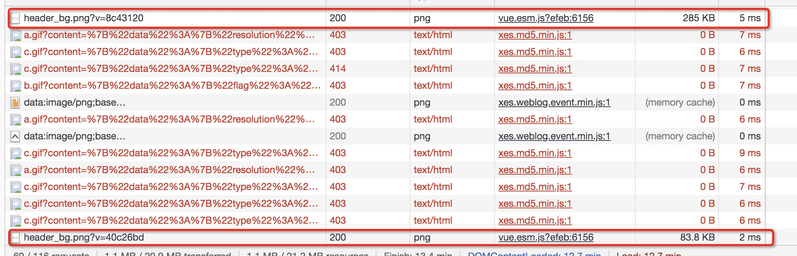
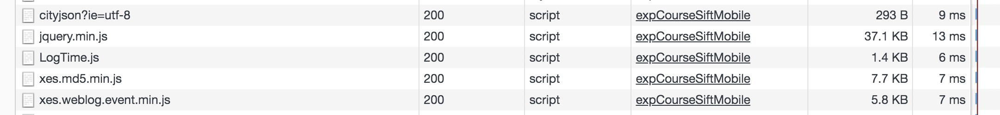
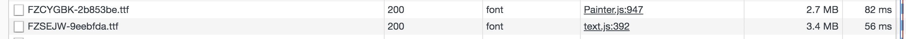

## 精品课约课、结果页性能优化方案

* 图片压缩

  > 如下图约课头图压缩前加载时间5ms，压缩后文件大小缩小70%左右，加载速度缩小到2ms (可使用的压缩网站:https://tinypng.com/);精品课约课使用大量的小图标，压缩后

  

* 日志埋点方案优化(可采用最新埋点方案)

  > 如下图老版的日志埋点加载js资源大约耗时30多毫秒

  

* 打包的各项依赖的集合(vue、vue-router等)生成的临时app.js文件瘦身

  > 如下图，约课首页该app.js有6点多兆,加载时间60多毫秒 
  
  >瘦身方案: 1、筛查所有依赖包，删除无效依赖 2、可通过cdn来加载第三方库，且在webpack.config.js中告诉webpack不用打包该第三方库。

  

* 减少资源请求——引入文件但并未使用需删除

  > 例如:精品课约课index.html引入//res12.xesimg.com/x5home_2.0/common/css/iconfont.css;加载耗时约6毫秒，删除该引入，暂时并未发现约课页有异常。

* 字体按需引入——避免文件过大

  > 如下入:英语定级结果页，加载的两个字体文件共6.1M加载时间135ms左右
  

* CSS优化

  > 使用高效合理的css选择符，避免使用通配规则，减少标签选择，减少嵌套层数等。

* js优化

  > 查找删除js中无用代码(比如某个函数定义了，但并未使用等);代码优化尽可能得减少算法复杂度；避免使用嵌套调用接口；在标签中使用async或defer特性防止渲染阻塞；较少对DOM的操作，所有可能导致重绘和重流的操作都要慎重且需进行优化(比如经常有改动的节点脱离文档流等)等

* ajax请求优化——axios同一请求会发送两次

  > Axios默认的Content-Type为application/json，属于非简单请求，所以客户端在发送请求时，会先发送预请求(options)；确认是否需要发送预请求，若需要可对preflight进行缓存减少请求时长；若不需要可将请求优化成简单请求。

* 资源懒加载/资源预加载

  > 非首屏资源可进行懒加载，为首屏的渲染减小负担。可让浏览器提前加载指定资源preload。告诉浏览器未来可能使用到的资源，浏览器空闲就会去加载prefetch.

* 资源缓存

  > 缓存应用资源，避免每次请求都发送相同的内容(浏览器缓存)。

* 其他代码优化

  > html等代码优化，删除无效代码，合理使用html标签等 

