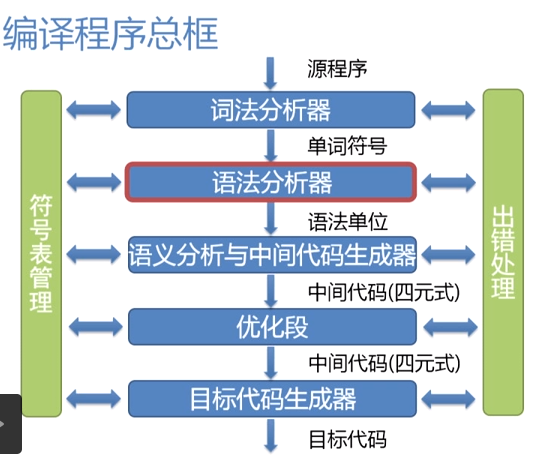
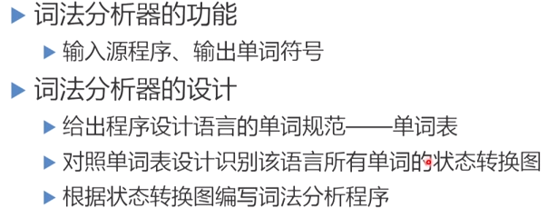
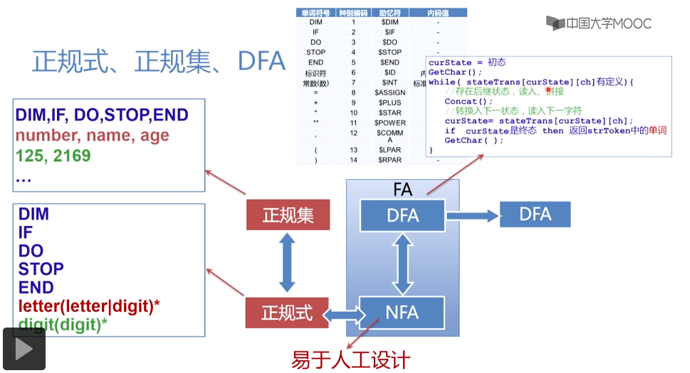
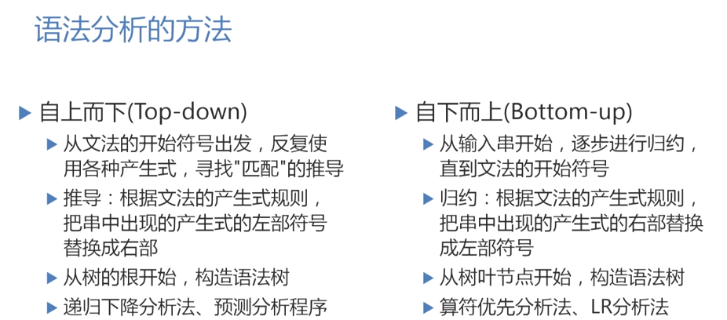

## 小实验理解编译原理

> 编译器是将汇编或高级计算机语言翻译为二进制机器语言代码的计算机程序。



### 步骤一 —— 定义四则运算:产出四则运算的词法定义和语法定义

> 四则运算即加减乘除四种运算，如：1+2*3

> 词法定义:
- Token
  
  - Number : 1 2 3 4 5 6 7 8 9 0 的组合
  - Operator : +、-、*、/ 之一

- Whitespace : 空格 

- LineTerminator : 回车

> 语法定义： 多采用BNF(巴科斯范式) https://blog.csdn.net/liuyanhuasd/article/details/79112151 核心思想：几种结构的组合产生一个新的结构

```html
eg:
<Expression> ::= 
  <AdditiveExpression><EOF>
<AdditiveExpression> ::= 
  <MultiplicativeExpression>
  |<AdditiveExpression><+><MultiplicativeExpression>
  |<AdditiveExpression><-><MultiplicativeExpression>
<MultiplicativeExpression> ::= 
  <Number>
  |<MultiplicativeExpression><*><Number>
  |<MultiplicativeExpression></><Number>

<!-- 因为加减乘除有优先级，可以认为加法是由若干个乘法再由加号或者减号连接成的 -->
```

### 步骤二 —— 词法分析:把输入的字符串流变成token

> 词法分析器



> 词法分析程序自动生成



> 词法分析有两种方案:方案一、状态机 方案二、正则表达式

```js
var token = [];
var source = []
const start = char => {
  if(char === '1' 
    || char === '2'
    || char === '3'
    || char === '4'
    || char === '5'
    || char === '6'
    || char === '7'
    || char === '8'
    || char === '9'
    || char === '0'
  ) {
    token.push(char);
    return inNumber;   
  }
  if(char === '+' 
    || char === '-'
    || char === '*'
    || char === '/'
  ) {
    emmitToken(char, char);
    return start
  }
  if(char === ' ') {
    return start;
  }
  if(char === '\r' 
    || char === '\n'
  ) {
    return start;
  }
}
const inNumber = char => {
  if(char === '1' 
    || char === '2'
    || char === '3'
    || char === '4'
    || char === '5'
    || char === '6'
    || char === '7'
    || char === '8'
    || char === '9'
    || char === '0'
  ) {
    token.push(char);
    return inNumber;
  } else {
    emmitToken("Number", token.join(""));
    token = [];
    return start(char); // put back char
  }
}

// 运行

function emmitToken(type, value) {
  alert(value);
  obj ={
    type: type,
    value: value
  }
  source.push(obj)
}
var input = "1024 + 2 * 256"

var state = start;

for(var c of input.split(''))
  state = state(c);

state(Symbol('EOF'))
console.log(source)

// 流式处理
var tokens = [{
    type:"Number",
    value: "1024"
}, {
    type:"+"
    value: "+"
}, {
    type:"Number",
    value: "2"
}, {
    type:"*"
    value: "*"
}, {
    type:"Number",
    value: "256"
}, {
    type:"EOF"
}];

```

### 步骤三 —— 语法分析:把token变成抽象语法树AST

> 语法分析基本概念



> LL语法分析根据每个产生式来写一个函数，例如：根据产生式，AdditiveExpression需要处理三种情况，那么就要写三个if分支来处理

```js
function AdditiveExpression(source){
    if(source[0].type === "MultiplicativeExpression") {
        let node = {
            type:"AdditiveExpression",
            children:[source[0]]
        }
        source[0] = node;
        return node;
    } 
    if(source[0].type === "AdditiveExpression" && source[1].type === "+") {
        let node = {
            type:"AdditiveExpression",
            operator:"+",
            children:[source.shift(), source.shift(), MultiplicativeExpression(source)]
        }
        source.unshift(node);
    }
    if(source[0].type === "AdditiveExpression" && source[1].type === "-") {
        let node = {
            type:"AdditiveExpression",
            operator:"-",
            children:[source.shift(), source.shift(), MultiplicativeExpression(source)]
        }
        source.unshift(node);
    }
}
function MultiplicativeExpression(){   

}

// 将解析好的token传给顶层处理函数Expression
function Expression(source){
    if(source[0].type === "AdditiveExpression" && source[1] && source[1].type === "EOF" ) {
        let node = {
            type:"Expression",
            children:[source.shift(), source.shift()]
        }
        source.unshift(node);
        return node;
    }
    AdditiveExpression(source);
    return Expression(source);
}
function AdditiveExpression(source){
    if(source[0].type === "MultiplicativeExpression") {
        let node = {
            type:"AdditiveExpression",
            children:[source[0]]
        }
        source[0] = node;
        return AdditiveExpression(source);
    } 
    if(source[0].type === "AdditiveExpression" && source[1] && source[1].type === "+") {
        let node = {
            type:"AdditiveExpression",
            operator:"+",
            children:[]
        }
        node.children.push(source.shift());
        node.children.push(source.shift());
        MultiplicativeExpression(source);
        node.children.push(source.shift());
        source.unshift(node);
        return AdditiveExpression(source);
    }
    if(source[0].type === "AdditiveExpression" && source[1] && source[1].type === "-") {
        let node = {
            type:"AdditiveExpression",
            operator:"-",
            children:[]
        }
        node.children.push(source.shift());
        node.children.push(source.shift());
        MultiplicativeExpression(source);
        node.children.push(source.shift());
        source.unshift(node);
        return AdditiveExpression(source);
    }
    if(source[0].type === "AdditiveExpression")
        return source[0];
    MultiplicativeExpression(source);
    return AdditiveExpression(source);
}
function MultiplicativeExpression(source){
    if(source[0].type === "Number") {
        let node = {
            type:"MultiplicativeExpression",
            children:[source[0]]
        }
        source[0] = node;
        return MultiplicativeExpression(source);
    } 
    if(source[0].type === "MultiplicativeExpression" && source[1] && source[1].type === "*") {
        let node = {
            type:"MultiplicativeExpression",
            operator:"*",
            children:[]
        }
        node.children.push(source.shift());
        node.children.push(source.shift());
        node.children.push(source.shift());
        source.unshift(node);
        return MultiplicativeExpression(source);
    }
    if(source[0].type === "MultiplicativeExpression"&& source[1] && source[1].type === "/") {
        let node = {
            type:"MultiplicativeExpression",
            operator:"/",
            children:[]
        }
        node.children.push(source.shift());
        node.children.push(source.shift());
        node.children.push(source.shift());
        source.unshift(node);
        return MultiplicativeExpression(source);
    }
    if(source[0].type === "MultiplicativeExpression")
        return source[0];

    return MultiplicativeExpression(source);
};

var source = [{
    type:"Number",
    value: "3"
}, {
    type:"*",
    value: "*"
}, {
    type:"Number",
    value: "300"
}, {
    type:"+",
    value: "+"
}, {
    type:"Number",
    value: "2"
}, {
    type:"*",
    value: "*"
}, {
    type:"Number",
    value: "256"
}, {
    type:"EOF"
}];
var ast = Expression(source);

console.log(ast);


```

### 步骤四 —— 解释执行:后序遍历AST,执行得出结果

```js
// 对AST树做遍历

function evaluate(node) {
  if(node.type === "Expression") {
      return evaluate(node.children[0])
  }
  if(node.type === "AdditiveExpression") {
      if(node.operator === '-') {
          return evaluate(node.children[0]) - evaluate(node.children[2]);
      }
      if(node.operator === '+') {
          return evaluate(node.children[0]) + evaluate(node.children[2]);
      }
      return evaluate(node.children[0])
  }
  if(node.type === "MultiplicativeExpression") {
      if(node.operator === '*') {
          return evaluate(node.children[0]) * evaluate(node.children[2]);
      }
      if(node.operator === '/') {
          return evaluate(node.children[0]) / evaluate(node.children[2]);
      }
      return evaluate(node.children[0])
  }
  if(node.type === "Number") {
      return Number(node.value);
  }
}

```