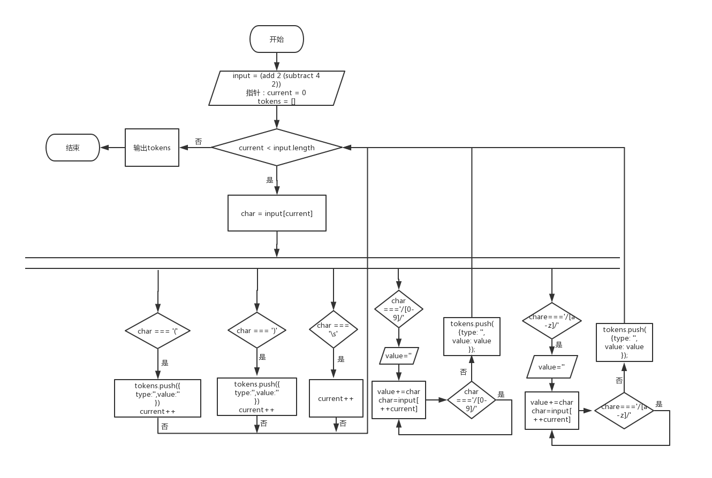
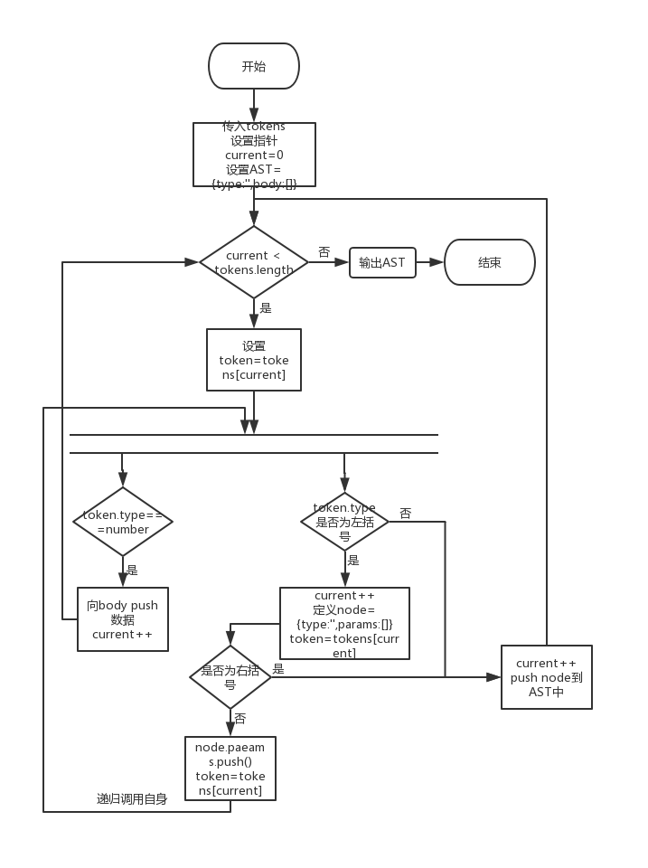
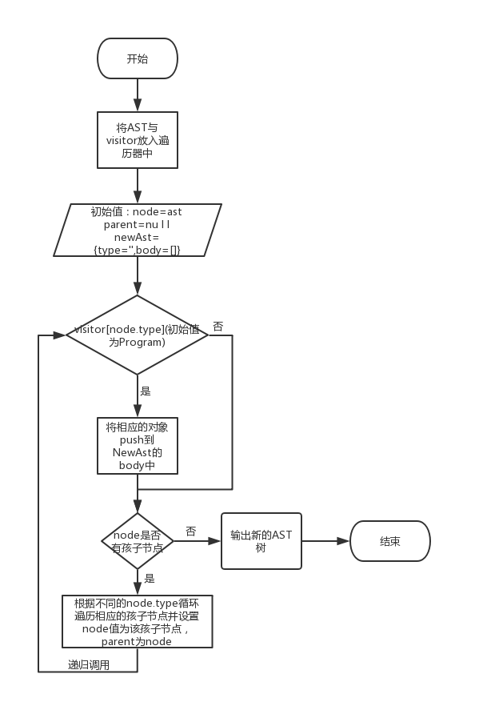
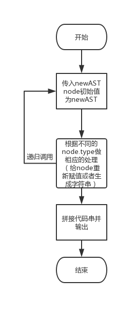

## 编译器实现原理

### 阶段一 解析(Parsing) 将最初原始的代码转换为AST树

* 词法分析 生成tokens

  > tokens生成过程如下：
---

---

* 语法分析，接收tokens，将其转换为AST树

  > AST生成过程如下：
---

---

### 阶段二 转换(Transformation) 处理AST树

* 可将AST树直接进行修改、删除、添加；也可生成新的AST树

  > newAST生成过程如下：

---

---
  
  > 深度遍历AST树，visitor其实为指定节点，当遍历到该visitor节点，进行相应的处理，最终生成全新的AST树。

### 阶段三 代码生成(Code Generation) 

* 代码生成即遍历新AST树，将每个节点拼接到字符串中

  > 代码生成过程如下：

---

---

### 总结

> 大多数的编译器可分为三个阶段:解析、转换以及代码生成；解析分为词法分析和语法分析两个阶段。不是所有的编译器都如上述一样，编译目的不同其步骤也不同，但原理是一致的。

#### 参考地址：https://github.com/starkwang/the-super-tiny-compiler-cn/blob/master/super-tiny-compiler-chinese.js
